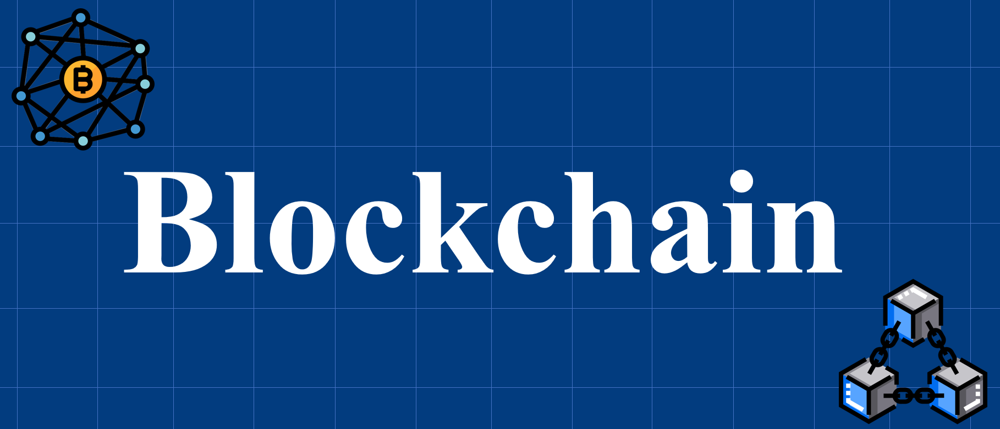

# 1. Understanding Blockchain Systems ₿⛓️ 

## 1.1 Prefatory Notes 📝
Welcome to this exploration of blockchain technology—a field that has rapidly evolved from the creation of Bitcoin to a vast ecosystem of programmable, interconnected networks. This guide is designed to provide a clear and structured understanding of blockchain systems, catering to both newcomers and experienced technologists.

This document balances technical rigor with accessibility, using diagrams, examples, and illustrative metaphors to make complex concepts approachable. Whether your goal is research, development, or strategic insight, these notes will serve as a comprehensive reference for understanding the blockchain landscape.
## 1.2 Introducing Blockchain: From Bitcoin to Distributed Ledgers ₿➡️📚
Blockchain, or more broadly, Distributed Ledger Technology (DLT), is a relatively new and exciting field that is still largely unexplored. This technology has the potential to create unified platforms capable of providing both technical and practical solutions. Such platforms could streamline processes across industries while improving transparency, trust, and reliability in operations.

### 1.2.1 Distributed Ledger

A **distributed ledger**—also known as a shared ledger or DLT—is essentially a synchronized and replicated digital database spread across multiple locations, organizations, or countries. Unlike traditional databases, there is no central authority controlling it, and no single point of failure exists.

Every participant, or **node**, in the network independently constructs updates to the ledger. Nodes then “vote” on these updates to ensure the majority agrees, a process known as **consensus**. This is achieved automatically through algorithms that validate the updates. Once consensus is reached, the ledger is updated across all nodes, ensuring that every participant holds the same verified version of the data.

### 1.2.2 Blockchain

**Blockchain** is a special type of distributed ledger. While all blockchains are distributed ledgers, not all distributed ledgers use a chain of blocks. What sets blockchain apart is its unique structure: a continuously growing sequence of records, called **blocks**, linked together.

In a blockchain network, transactions between participants are recorded in a verifiable and permanent way. The system operates on a **peer-to-peer network**, where each participant is a node that validates data according to predefined rules before broadcasting it to others. This decentralized validation ensures integrity, making blockchain distinct from standard distributed ledgers.

### 1.2.2.1 Applications of Blockchain

Blockchain can transform many areas of life and business:

- **Goods transfer**: supply chain management
- **Digital media transfer**: selling art or music
- **Remote services**: travel and tourism
- **Decentralized business logic**: insurance, education credentials, computing outside the cloud
- **Distributed resources**: power generation and distribution
- **Crowdfunding**: raising money for startups
- **Crowd operations**: electronic voting
- **Identity management**: one ID for all life functions
- **Government records**: open and transparent governance

Blockchain also supports an inclusive economy. Even people in remote areas can join democratic and financial processes. The possibilities for new applications are endless.

### 1.2.3 Blockchain and Bitcoin

Blockchain gained fame as the technology behind **Bitcoin**, but its use extends far beyond cryptocurrency. It is entirely possible to deploy a decentralized blockchain without creating a cryptocurrency.

Originally, blockchain referred to the design underlying Bitcoin. Interestingly, the term "blockchain" did not appear in Bitcoin’s first whitepaper. The creator of Bitcoin didn’t invent a completely new technology; instead, they combined existing technologies in a novel way to enable a “purely peer-to-peer version of electronic cash.” From a broader perspective, blockchain can be seen as both an innovative software design and a compelling business case, not merely a technology.

### 1.2.3.1 Bitcoin and Its Role

To understand blockchain, we first study Bitcoin. Around 2008–2009, when financial markets collapsed, a mysterious person (or group) named **Satoshi Nakamoto** introduced Bitcoin. It allowed peer-to-peer transfer of value without a central authority. Trust and security were achieved through validation, verification, and consensus in the blockchain system.

Later, around 2012–2013, computation features were added to blockchain. This opened new possibilities beyond currency transfer and led toward **Web 3.0** innovations.

Bitcoin made two big contributions:

1.  A digital currency system that works continuously
2.  A model for decentralized applications called blockchain

## 1.3 Anatomy of a Blockchain Network 🧱🌐

* Block headers, Merkle roots, and data linkage 🌳🔗
* Transaction structures 💳📦
* UTXO versus account-based models ⚖️
* Full nodes, light clients, archival nodes 🖥️📱📦
* Network topology and peer discovery 🛰️🔍

## 1.4 Core Blockchain Mechanics ⚙️🚀

* Transaction flow and mempool dynamics 🔄🧺
* Consensus validation rules ✔️🤝
* Gossip protocols and network propagation 🗣️🌐
* Block creation and confirmation cycles ⛓️⏳
* Finality assumptions 🎯

## 1.5 Beyond the Original Bitcoin Vision 🌅💭

* General-purpose blockchains (Gen 2 & 3) 🧬
* Programmability and smart contracts 🤖📜
* Multi-chain & cross-chain evolution 🔀🌉
* Architectural limitations of early systems 🏛️⚠️

## 1.6 Blockchain Ecosystem Landscape 🌍📊

* Public vs private blockchains 🔓🔒
* Sidechains and rollups 🧩📈
* Consortium chains 🏢🤝
* Infrastructure and middleware layers 🛠️🧱

---
